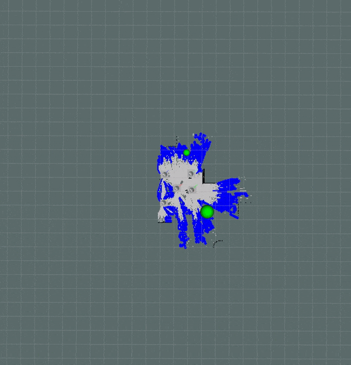
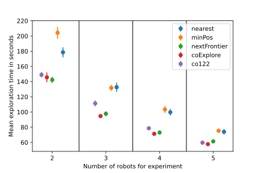
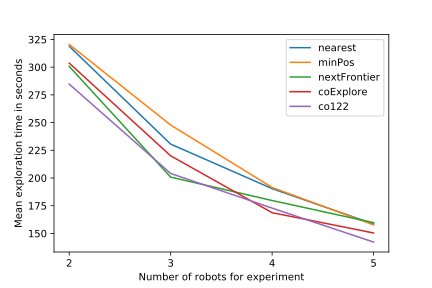
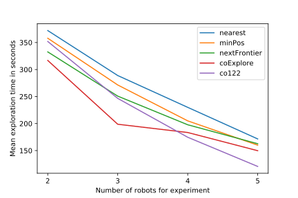

# coExplore: Repository for multi-robot exploration
---
<table style="margin-left: auto; margin-right: auto; table-layout: fixed; width: 100%"; class="center">
  <tr>
    <td style="width: 33%;"> <p align="center">5 robots in open environment</p></td>
    <td style="width: 33%;"> <p align="center">5 robots in office environment</p></td>
    <td style="width: 33%;"> <p align="center">5 robots in maze environment</p></td>
  </tr>
</table>

This repository contains research code for the development of our novel multi-robot exploration algorithm built with ROS1 called coExplore. Throughout this README we go over the installation, configuration, packages and possibilities in augmentation of this repository. The paper can be found [here](https://arxiv.org/abs/2303.17459). If you use this code in your research please include this bibtex:
```
@misc{scheler2023coexplore,
      title={coExplore: Combining multiple rankings for multi-robot exploration}, 
      author={Ingo Scheler and Robin Dietrich},
      year={2023},
      eprint={2303.17459},
      archivePrefix={arXiv},
      primaryClass={cs.RO}
}
```

<table style="margin-left: auto; margin-right: auto; table-layout: fixed; width: 100%"; class="center">
  <tr>
    <td style="width: 50%;"> <p align="center">Performance on map_3/open environment</p></td>
    <td style="width: 50%;"> <p align="center">Performance on marty/office environment</p></td>
    <td style="width: 50%;"> <p align="center">Performance on maze environment</p></td>
  </tr>
</table>

## System Prerequisites
This project was built with   
- ROS Noetic on Ubuntu 20.04.

## Install
</br>
This project is an extension of an existing repository for robotino robots.
To install these dependencies, first run the install_script.bash from a suitable catkin directory. This completely installs all the needed packages to run a minimal working version of the project.
</br>
</br>

## Configuration

Sourcing the config_script will give a printout of the options available
as well as the currently active setup.

```
source config_script.bash
```

```
-------------------------------------------------------------
coExplore configuration
-------------------------------------------------------------
tme_ROBOT_ENV: [marty, v2_maze, map_3]
tme_start_num: [2 - 5]
tme_expl_method: [nearest, minPos, nextFrontier, coExplore, co122]
tme_stop_time: number in seconds the simluation should run
-------------------------------------------------------------

```
eg. change the map with ``export tmb_ROBOT_ENV=map_3``

---
# Module Summary

### Robot_state_publisher
Publishes information about the robot state at a high frequency. Also provides the needed transforms for the robot parts.

### SLAM
For Simultaneous Localization and Mapping (SLAM) we use the slam_toolbox package. Configuration files are in the config folder in the tme_startup package. With map merging we are able to compute an overall map which gets explored by both robots where we can locate the blind robot in. In the accompanying videos you can see both robots exploring on their respective maps in the top and the resulting merge in the bottom.


### Path Planning
The path is computed by the move_base package by computing a global costmap on the robot maps and then utilizing the laser sensors to perceive the immediate environment and adjust to dynamic obstacles through the local costmap. Important here is that we set the costmap environment for each robot to the globally computed map so robot's can move with knowledge of the complete environment to not run into known dead-ends.

---
# Detailed Overview

## robot_state_publisher
This [package](http://wiki.ros.org/robot_state_publisher) allows you to publish the state of a robot to tf2. Once the state gets published, it is available to all components in the system that also use tf2. The package takes the joint angles of the robot as input and publishes the 3D poses of the robot links, using a kinematic tree model of the robot. Since in ROS noetic tf is deprecated in favor of tf2, the concept of a multi robots system using tf_prefix was not possible. Tf_prefix is designed for operating multiple similar robots in the same environment. The tf_prefix parameter allows two robots to have base_link frames, for they will become /robot1/base_link and /robot2/base_link if all nodes for robot1 are run in robot1 as their tf_prefix parameter. Therefore, we had to manually modify the **robot_state_publisher** package to be able to run multiple robots in our simulation.

## SLAM
We use [slam_toolbox](http://wiki.ros.org/slam_toolbox) with a largely base setup. The configuration is specified in the tme_startup folders.

## map_merge
To merge the maps acquired by the SLAM we use the [multirobot_map_merge](http://wiki.ros.org/multirobot_map_merge) package. This allows us to merge maps where the robot start positions are known. In theory the algorithm is also able to compute maps without knowing the start positions of the robot. This did not work in practice but we could overlay with known starting positions anyway. For known start positions the maps get overlayed. This means that deviations in SLAM lead to large deviations in the computed merged map. So a good SLAM is crucial for this to work properly.

## move_base
The [move_base](http://wiki.ros.org/move_base) ROS Node is a major component of the [Navigation Stack](http://wiki.ros.org/navigation).

The move_base package provides an implementation of an action (from action_lib) that, given a goal in the world, will attempt to reach it with a mobile base. The **move_base** node links together a **global and local planner** to accomplish its global navigation task. It supports any global planner adhering to the BaseGlobalPlanner interface specified in the nav_core package and any local planner adhering to the BaseLocalPlanner interface specified in the same package. The move_base node also maintains **two costmaps**, one for the global planner, and one for a local planner

---
# API

**frontierArray**
```yaml
topic: /{robot_name}/tme_frontier_search/frontierArray

frontierArray
frontiers: frontier[]
```
**frontier**
```yaml
frontier

size: int32
initial: geometry_msgs/Point
centroid: geometry_msgs/Point
points: geometry_msgs/Point[]
```
---
# Developing your own algorithm with this as a baseline
Look at the versions that are currently implemented. Check if what you need is already implemented in terms of information gain, distance measurement etc. Get a baseline performance for the environment you are evaluating through coExplore or nextFrontier. They performed quite well during our evaluation. 

Start running exploratory evaluations for your algorithms performance. See if the exploration times are up to par and evaluate the through our eval_2 script. The basics can be run quite quickly if you have sufficient runs and they meet our evaluation criteria, in terms of map_coverage and allowed travel_distances per 5 sec interval. Change the map_coverage if you use different maps. Estimate the map_coverage percentage by making a multitude of runs and observing slam errors etc. The maximum travel_distance needs to be changed depending on robot speed, this can also work when looking at maps with disturbed SLAM performance. 
## If you need to develop new features
Depending on what kind of new information you want to develop the location you need to adopt changes. For frontier based developments you need to change the .cpp files to incorporate your stuff, for distance measurements etc. you can make the changes in decentralized_frontier_assign. Keep in mind that python performance can be lacking depending on the algorithm you want to develop. Keep this in since this can decrease algorithm performance greatly. 


---

# Possible further development

- switch to ROS2, better developed navigation stack and slam_toolbox versions because of problems we encountered:
  - robots stop moving or start spinning randomly
  - map does not get resized accurately when obstacle outside of current map by 1 pixel
- new algorithm versions
- create a bigger map
- increase performance
